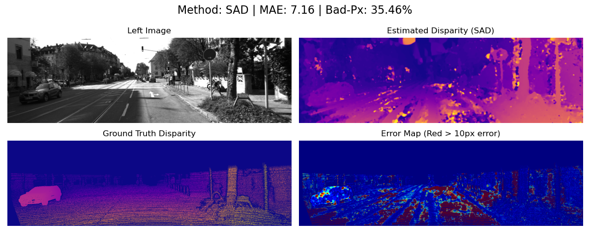
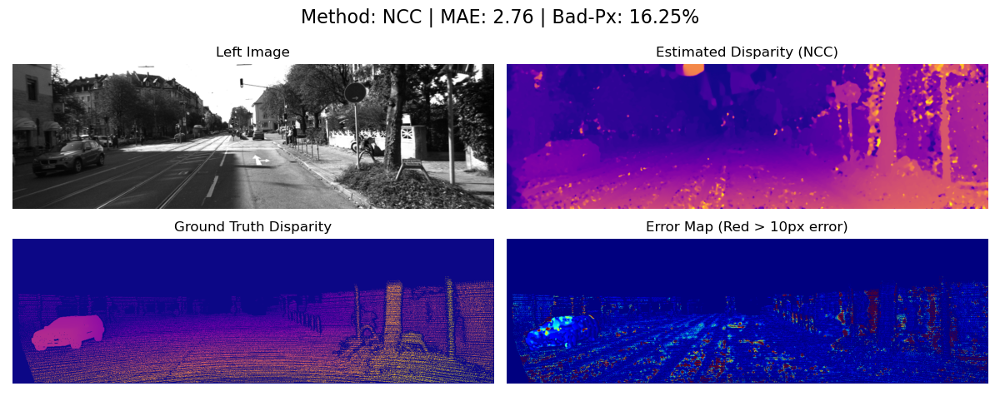
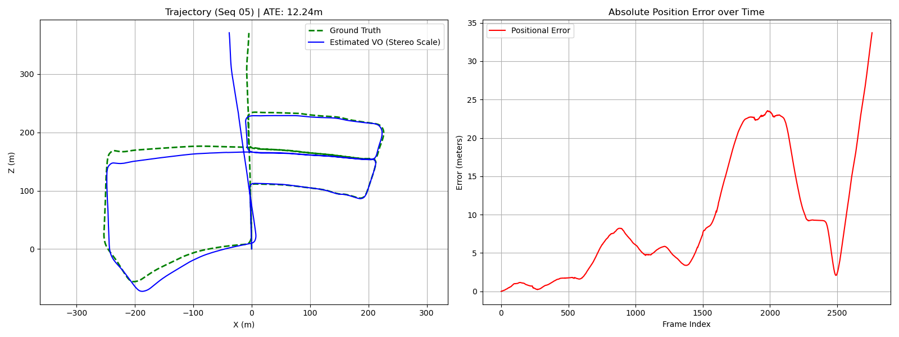

# KITTI Stereo Matching & Visual Odometry

A computer vision pipeline implemented in Python (OpenCV) that performs **Dense Depth Estimation** using stereo block matching and **Monocular Visual Odometry** for trajectory estimation.

## Project Structure

The project is divided into two main modules:
1.  **Part A: Stereo Matching** - Generates disparity maps and depth from stereo image pairs.
2.  **Part B: Visual Odometry (VO)** - Estimates the camera trajectory over time using feature tracking.

---

## Datasets

This project uses the **KITTI Vision Benchmark Suite**:

1.  **Stereo Evaluation 2015 (Scene Flow):** Used for Part A (Depth).
    *   [Download Link](https://www.cvlibs.net/datasets/kitti/eval_scene_flow.php?benchmark=stereo)
2.  **Odometry Benchmark (Sequence 00 - 10):** Used for Part B (Motion).
    *   [Download Link](https://www.cvlibs.net/datasets/kitti/eval_odometry.php)

---

## 1. Stereo Matching (Depth Estimation)

We implemented Block Matching algorithms to compute the disparity map between left and right images.

### Methods Implemented
*   **SAD** (Sum of Absolute Differences)
*   **SSD** (Sum of Squared Differences)
*   **NCC** (Normalized Cross Correlation)

### Results Comparison
We evaluated the algorithms based on **MAE** (Mean Absolute Error) and **Bad Pixel Percentage** (pixels with >3px error).

| Method | MAE | Bad-Px (%) | Visual Quality |
| :--- | :--- | :--- | :--- |
| **SAD** | 7.16 | 35.46% | Noisy, sensitive to intensity changes. |
| **SSD** | 6.58 | 33.28% | Slightly better than SAD, but still noisy. |
| **NCC** | **2.76** | **16.25%** | **Best performance.** Robust to lighting differences. |

### Visualizations
*Images are located in the `figures/` directory.*

#### 1. Sum of Absolute Differences (SAD)


#### 2. Sum of Squared Differences (SSD)


#### 3. Normalized Cross Correlation (NCC) - *Best Result*


---

## 2. Stereo-Visual Odometry (Motion Estimation)

We implemented a Stereo-VO pipeline to track the camera's path through **KITTI Odometry Sequences** (e.g., Seq 05). Unlike Monocular VO, this method recovers **absolute scale** without ground truth.

### Pipeline Steps
1.  **Feature Detection:** `goodFeaturesToTrack` (Shi-Tomasi) on the current frame.
2.  **Feature Tracking:** Lucas-Kanade Optical Flow (KLT) to track points from frame $t-1$ to $t$.
3.  **Depth Recovery:** We use the **Stereo Disparity** (from Part A) of frame $t-1$ to back-project 2D tracked points into **3D space**.
4.  **Motion Estimation (PnP):** We use `solvePnPRansac` to find the rotation ($R$) and translation ($t$) that minimizes the reprojection error between the 3D points (at $t-1$) and their 2D projections (at $t$).
5.  **Trajectory Update:** The calculated motion is accumulated to update the global camera pose.

### Evaluation Metrics
*   **ATE (Absolute Trajectory Error):** Root Mean Square Error of the global path.
*   **RPE (Relative Pose Error):** Local drift error over fixed frame steps.

### Trajectory Result
*(The blue line represents our estimated path, while the green dashed line is the ground truth).*



---

## Dependencies

*   Python 3.x
*   NumPy
*   OpenCV (`opencv-python`)
*   Matplotlib

## How to Run

1.  **Clone the repository:**
    ```bash
    git clone https://github.com/MohammadHMazarei/KITTI-stereo-odometry.git
    ```
2.  **Install requirements:**
    ```bash
    pip install numpy opencv-python matplotlib
    ```
3.  **Run the notebooks:**
    *   `stereo-depth.ipynb` for disparity maps.
    *   `stereo-visual-odometry.ipynb` for trajectory estimation.
